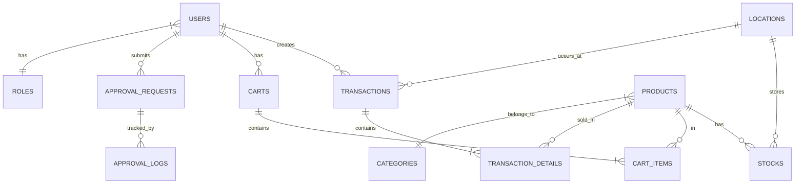

# Database Architecture

## Overview

This document describes the database design patterns used in the Enterprise Retail POS system. The schema is designed for multi-location inventory management with approval workflows.

## Entity Relationship Diagram



## Core Tables

### Products Table
Stores product information with soft delete support.

```sql
CREATE TABLE products (
    id BIGINT UNSIGNED PRIMARY KEY AUTO_INCREMENT,
    barcode VARCHAR(50) UNIQUE NOT NULL,
    title VARCHAR(255) NOT NULL,
    price DECIMAL(15,2) NOT NULL DEFAULT 0,
    category_id BIGINT UNSIGNED,
    supplier_id BIGINT UNSIGNED,
    image VARCHAR(255),
    description TEXT,
    is_active BOOLEAN DEFAULT TRUE,
    created_at TIMESTAMP DEFAULT CURRENT_TIMESTAMP,
    updated_at TIMESTAMP DEFAULT CURRENT_TIMESTAMP ON UPDATE CURRENT_TIMESTAMP,
    deleted_at TIMESTAMP NULL,
    
    INDEX idx_barcode (barcode),
    INDEX idx_category (category_id),
    INDEX idx_supplier (supplier_id),
    INDEX idx_active (is_active)
);
```

### Stocks Table
Tracks inventory per product per location.

```sql
CREATE TABLE stocks (
    id BIGINT UNSIGNED PRIMARY KEY AUTO_INCREMENT,
    product_id BIGINT UNSIGNED NOT NULL,
    location_id BIGINT UNSIGNED NOT NULL,
    quantity INT NOT NULL DEFAULT 0,
    status ENUM('pending', 'approved', 'rejected') DEFAULT 'pending',
    input_by BIGINT UNSIGNED,
    approved_by BIGINT UNSIGNED,
    approved_at TIMESTAMP NULL,
    notes TEXT,
    created_at TIMESTAMP DEFAULT CURRENT_TIMESTAMP,
    updated_at TIMESTAMP DEFAULT CURRENT_TIMESTAMP ON UPDATE CURRENT_TIMESTAMP,
    
    INDEX idx_product_location (product_id, location_id),
    INDEX idx_status (status),
    
    FOREIGN KEY (product_id) REFERENCES products(id) ON DELETE CASCADE,
    FOREIGN KEY (location_id) REFERENCES locations(id) ON DELETE CASCADE
);
```

### Transactions Table
Records completed sales transactions.

```sql
CREATE TABLE transactions (
    id BIGINT UNSIGNED PRIMARY KEY AUTO_INCREMENT,
    invoice_number VARCHAR(50) UNIQUE NOT NULL,
    user_id BIGINT UNSIGNED NOT NULL,
    location_id BIGINT UNSIGNED NOT NULL,
    customer_id BIGINT UNSIGNED NULL,
    subtotal DECIMAL(15,2) NOT NULL DEFAULT 0,
    discount DECIMAL(15,2) DEFAULT 0,
    total DECIMAL(15,2) NOT NULL DEFAULT 0,
    cash_received DECIMAL(15,2) DEFAULT 0,
    change_amount DECIMAL(15,2) DEFAULT 0,
    payment_method ENUM('cash', 'transfer', 'card') DEFAULT 'cash',
    status ENUM('completed', 'cancelled', 'deleted') DEFAULT 'completed',
    notes TEXT,
    created_at TIMESTAMP DEFAULT CURRENT_TIMESTAMP,
    
    INDEX idx_invoice (invoice_number),
    INDEX idx_user (user_id),
    INDEX idx_location (location_id),
    INDEX idx_created (created_at),
    INDEX idx_status (status),
    
    FOREIGN KEY (user_id) REFERENCES users(id),
    FOREIGN KEY (location_id) REFERENCES locations(id)
);
```

## Approval Workflow Tables

### Edit Product Requests
Tracks requests to modify product information.

```sql
CREATE TABLE edit_product_requests (
    id BIGINT UNSIGNED PRIMARY KEY AUTO_INCREMENT,
    product_id BIGINT UNSIGNED NOT NULL,
    requested_by BIGINT UNSIGNED NOT NULL,
    
    -- Proposed changes
    new_title VARCHAR(255),
    new_price DECIMAL(15,2),
    new_category_id BIGINT UNSIGNED,
    
    reason TEXT,
    status_id TINYINT DEFAULT 1, -- 1=pending, 2=approved, 3=rejected
    
    approved_by BIGINT UNSIGNED NULL,
    approved_at TIMESTAMP NULL,
    rejected_by BIGINT UNSIGNED NULL,
    rejected_at TIMESTAMP NULL,
    rejection_reason TEXT,
    
    created_at TIMESTAMP DEFAULT CURRENT_TIMESTAMP,
    
    INDEX idx_product (product_id),
    INDEX idx_status (status_id),
    INDEX idx_requester (requested_by)
);
```

### Approval Logs
Audit trail for all approval actions.

```sql
CREATE TABLE approval_logs (
    id BIGINT UNSIGNED PRIMARY KEY AUTO_INCREMENT,
    approvable_type VARCHAR(100) NOT NULL,
    approvable_id BIGINT UNSIGNED NOT NULL,
    action ENUM('submitted', 'approved', 'rejected') NOT NULL,
    user_id BIGINT UNSIGNED NOT NULL,
    notes TEXT,
    created_at TIMESTAMP DEFAULT CURRENT_TIMESTAMP,
    
    INDEX idx_approvable (approvable_type, approvable_id),
    INDEX idx_user (user_id),
    INDEX idx_created (created_at)
);
```

## Stock Opname Tables

### Stock Opname Batches
Groups stock opname activities by batch.

```sql
CREATE TABLE stock_opname_batches (
    id BIGINT UNSIGNED PRIMARY KEY AUTO_INCREMENT,
    user_id BIGINT UNSIGNED NOT NULL,
    location_id BIGINT UNSIGNED NOT NULL,
    total_items INT DEFAULT 0,
    success_count INT DEFAULT 0,
    failed_count INT DEFAULT 0,
    status ENUM('processing', 'completed', 'cancelled') DEFAULT 'processing',
    notes TEXT,
    created_at TIMESTAMP DEFAULT CURRENT_TIMESTAMP,
    completed_at TIMESTAMP NULL,
    
    INDEX idx_user (user_id),
    INDEX idx_location (location_id),
    INDEX idx_status (status)
);

CREATE TABLE stock_opname_details (
    id BIGINT UNSIGNED PRIMARY KEY AUTO_INCREMENT,
    batch_id BIGINT UNSIGNED NOT NULL,
    product_id BIGINT UNSIGNED NOT NULL,
    system_quantity INT NOT NULL,
    actual_quantity INT NOT NULL,
    difference INT GENERATED ALWAYS AS (actual_quantity - system_quantity) STORED,
    notes TEXT,
    created_at TIMESTAMP DEFAULT CURRENT_TIMESTAMP,
    
    INDEX idx_batch (batch_id),
    INDEX idx_product (product_id),
    
    FOREIGN KEY (batch_id) REFERENCES stock_opname_batches(id) ON DELETE CASCADE
);
```

## Indexing Strategy

### High-Frequency Queries
1. **Product lookup by barcode** - Used in POS scanning
2. **Stock by product + location** - Inventory checks
3. **Transactions by date range** - Reporting

### Composite Indexes
```sql
-- For inventory lookups
CREATE INDEX idx_stock_product_location_status 
ON stocks(product_id, location_id, status);

-- For transaction reporting
CREATE INDEX idx_transaction_location_date 
ON transactions(location_id, created_at);

-- For approval workflow
CREATE INDEX idx_approval_status_type 
ON edit_product_requests(status_id, created_at);
```

## Best Practices Applied

1. **Soft Deletes** - Products use `deleted_at` for data recovery
2. **Audit Trails** - All critical operations logged
3. **Normalized Schema** - Proper foreign key relationships
4. **Optimized Indexes** - Based on query patterns
5. **Status Tables** - Flexible state management
6. **Location Isolation** - All inventory operations location-aware
